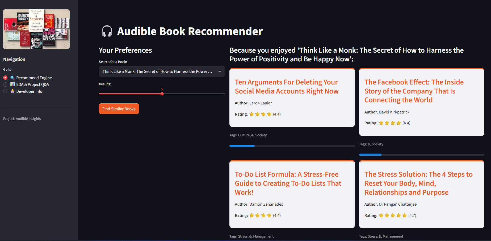
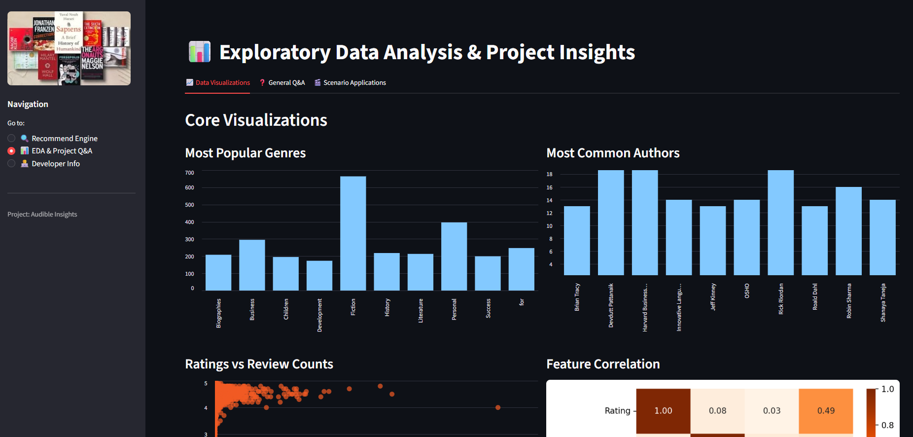
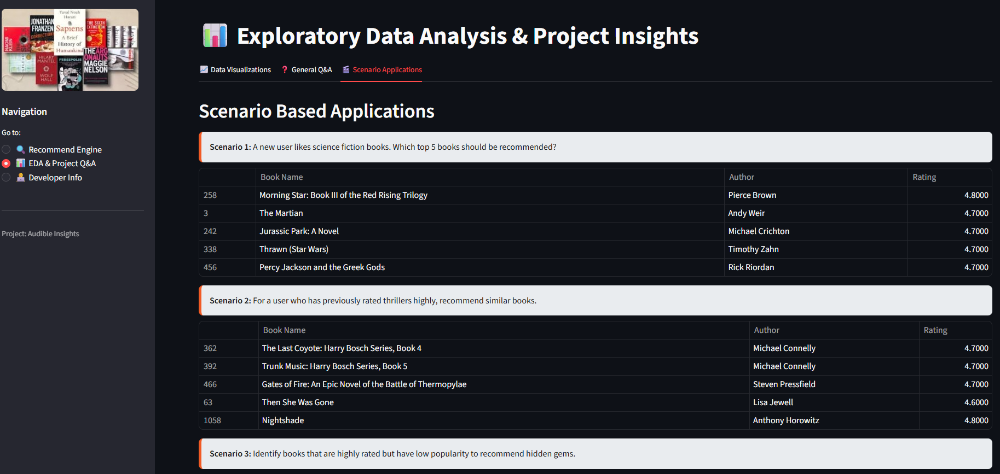

# 🎧 Audible Insights: Advanced Book Recommendation System

A professional AI-driven web application that provides personalized audiobook recommendations using NLP, K-Means Clustering, and Bayesian quality ranking.


---

## 📸 Application Preview

### 🔍 Recommendation Engine
*Real-time content-based filtering with explainable AI tags.*


### 📊 In-Depth Analytics
*Exploratory Data Analysis showing genre trends and rating distributions.*


### 👨‍💻 Scenario Application
*Scenario Based Application.*


---

## 🚀 Project in Short

### The Goal
To solve the "discovery problem" in the Audible catalog by suggesting books that are not just similar in text, but also verified for quality.

### The Tech Stack
- **Interface:** Streamlit (Python)
- **ML Models:** TF-IDF Vectorization, K-Means Clustering, Cosine Similarity
- **Ranking:** Bayesian Weighted Average (Normalizing Ratings vs. Popularity)
- **Visuals:** Matplotlib, Seaborn, Custom CSS

### Key Features
- **Smart Search:** Finds matches based on book descriptions and themes.
- **Explainability:** Shows shared genre tags between source and recommendation.
- **Hidden Gems:** Identifies high-rated books with low review counts for niche discovery.

---

## 🛠️ Installation & Setup

1. Clone & Enter Folder:
   ```bash
   git clone [https://github.com/yourusername/audible-recommender.git](https://github.com/yourusername/audible-recommender.git)
   cd audible-recommender
   ```
---
2. Install Requirements:
pip install -r requirements.txt

---
3. Run App:
streamlit run app.py

---
### 👤 Developer:
Atharva Borawake,
Data Scientist / AI Engineer 
